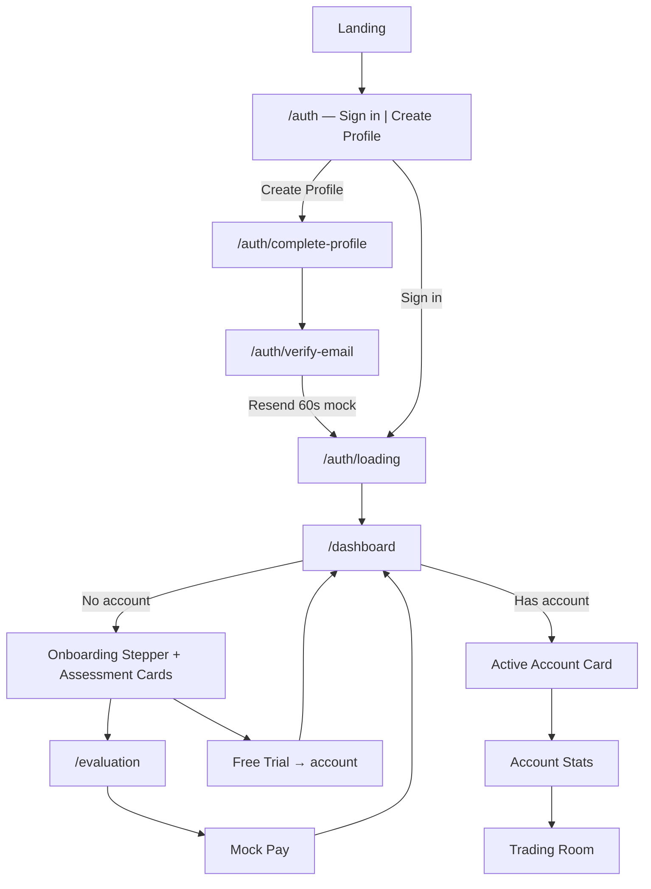

# tradeox — Market Rush Evaluation Flow Spec
## Agent Build Document v1.2 | May 2026

> **Purpose:** This document replaces the **in-app navigation model** and **post-login user journey** described in `PROJECT_DOCS.md` §6–§9.  
> **Do not delete `PROJECT_DOCS.md`.** It remains the source of truth for stack, landing page, auth, mock-data strategy, and backend plans.  
> **This spec is frontend-only.** All data comes from `src/lib/mock/` and Zustand stores. No real API calls.

---

## 0. Agent Instructions (Read First)

You are refactoring **tradeox** from a **broker-style paper trading app** (Dashboard → Trade → Portfolio sidebar) into an **evaluation-platform flow** modeled on [Market Rush](https://marketrush.in/).

### What is already built (Phases 1–9 frontend)
| Area | Status | Location |
|---|---|---|
| Landing page | ✅ Done | `src/pages/LandingPage.tsx`, `src/components/landing/*` |
| Auth UI (mock) | ⚠️ **Replace** — old split login/signup | `LoginPage.tsx`, `SignupPage.tsx` → new Market Rush auth flow |
| Old app shell | ✅ Done but **to be replaced** | `src/components/shell/AppShell.tsx`, `Sidebar.tsx`, `Topbar.tsx` |
| Old dashboard (bento) | ✅ Done but **to be replaced** | `src/pages/DashboardPage.tsx` |
| Old trade page | ✅ Done — **reuse parts in Trading Room** | `src/pages/TradePage.tsx`, `ChartPanel`, `OrderEntryPanel` |
| Portfolio / Analytics / Journal / Leaderboard | ✅ Done — **deprioritize or hide** | respective pages under `src/pages/` |
| Mock data layer | ✅ Done — **extend, don't break** | `src/lib/mock/*`, `src/store/*` |
| Calculations | ✅ Done — **extend for evaluation metrics** | `src/lib/calculations.ts` |

### What you must build (this spec) — **build in phase order (§10)**

**Phase 0 first:** Auth & onboarding flow (§2, §4.0) — match light-theme Market Rush login screens exactly.

Then:
1. New **evaluation-centric sidebar** (white sidebar + black Start Evaluation CTA)
2. New **breadcrumb topbar** (light theme shell)
3. New **Accounts Dashboard** with onboarding stepper + assessment cards (**light theme**)
4. New **Paid Assessment Checkout** — single scroll page `/evaluation` (program + plans + order summary)
5. New **Account Stats** page (dark theme — trading analytics)
6. New **Trading Room** (dark theme — full-screen terminal)
7. New **Search Instruments** modal
8. Mock modules + updated `authStore` registration steps
9. Updated routes in `App.tsx`

### Hard rules
- **Mock data only.** No Express, Neon, or Polygon.io in this phase.
- **Reuse existing components** where possible: `ChartPanel`, `OrderEntryPanel`, `useMockTicker`, `calculations.ts`, shadcn/ui primitives.
- **INR currency** for evaluation accounts (`₹`). Format with Indian locale (`en-IN`).
- **Theme split (Market Rush pattern):**
  - **Light theme** (`#FFFFFF` bg, navy `#002D5B` accents): Auth pages, app shell, dashboard, checkout.
  - **Dark theme** (`#0a0a0a` bg): Account Stats, Trading Room only.
- **White sidebar** always in evaluation shell (see §9.2).
- **Simulated disclaimer** on Dashboard, Stats, and Trading Room footers.
- Deprecate old routes by redirect — do not delete legacy files until migration verified.

---

## 1. Paradigm Shift: Old vs New

| Dimension | Old (`PROJECT_DOCS.md`) | New (this spec — Market Rush flow) |
|---|---|---|
| Mental model | Generic paper broker | Prop-firm **evaluation account** |
| Home after login | Bento dashboard with chart + watchlist | **Accounts list** + assessment CTAs |
| Primary action | Trade any symbol from sidebar | **View Stats** → **Trading Room** per account |
| Navigation | Dashboard, Trade, Portfolio, Watchlist… | Dashboard, Accounts, Profile, Billing, Rewards… |
| Account identity | Single virtual portfolio | Multiple **evaluation accounts** with unique IDs |
| Risk framing | Buying power, cash balance | **Max Loss**, **Daily Max Loss**, **Profit Target** objectives |
| Instrument picker | Watchlist + command palette | **Search Instruments** modal with index/futures filters |
| Trading UI | `/trade` page inside app shell | **Trading Room** — dedicated full-screen layout |

---

## 2. User Journey (Complete — Login → Evaluation)

### 2.1 Registration flow (new user)

```
Landing (/)
    ↓ [Get Started / Sign up]
/auth  —  Tab: "Create Profile"
    • Email + Password
    • [Create Profile] button
    • Continue with Google (mock)
    ↓
/auth/complete-profile
    • Title (Mr./Ms./Mrs.), Full name, Phone (+91)
    • Optional: Get onboarding help checkbox
    • [Continue]
    ↓
/auth/verify-email
    • "We sent a verification link to your email"
    • [← Back to login]  |  [Resend in 60s] → mock verify
    ↓
/auth/loading  —  circular spinner with tradeox logo (~1.5s)
    ↓
/dashboard  —  Onboarding stepper state (no evaluation account yet)
    • Stepper: Registered ✓ | Email Verified ✓ | Start Evaluation (flag)
    • Assessment cards below
    ↓ [Get Started / Start Free Trial / Start Evaluation]
/evaluation  OR  free trial account created
    ↓
/dashboard  —  Active account state (account card + assessment cards)
```

### 2.2 Sign-in flow (returning user)

```
Landing → /auth  —  Tab: "Sign in"
    • Email + Password
    • [Sign in] (mock)
    ↓
/auth/loading  (~1.5s spinner)
    ↓
/dashboard  —  skip verify if already email_verified
```

### 2.3 Post-dashboard flow (unchanged)

```
/dashboard (has account)
    ├── [View Stats] → /accounts/:id/stats  (dark)
    │       └── [Trading Room] → /accounts/:id/trading-room  (dark)
    ├── [Choose Assessment] → /evaluation  (light checkout)
    ├── [Start Free Trial] → creates account → /dashboard
    └── Sidebar [Start Evaluation] → /evaluation
```

### Mermaid flow



### 2.4 Auth state machine (`authStore`)

| Step | `registrationStep` | Redirect if missing |
|---|---|---|
| Not logged in | — | `/auth` |
| Created email/password | `registered` | `/auth/complete-profile` |
| Profile form done | `profile_completed` | `/auth/verify-email` |
| Email verified (mock) | `email_verified` | `/dashboard` |
| Has evaluation account | `evaluation_started` | `/dashboard` (full state) |

**Mock shortcuts:**
- Create Profile → sets `registered`, go complete-profile
- Continue on profile → sets `profile_completed`, go verify-email
- Resend after 60s OR any click on verify page → sets `email_verified`, go loading → dashboard
- Sign in (existing mock user) → `email_verified` immediately → loading → dashboard

---

## 3. Global Shell (Post-Login)

### 3.1 Layout regions

| Region | Spec |
|---|---|
| Left sidebar | Fixed **240 px**, **white background** (`#FFFFFF`), right border `1px #E5E7EB` |
| Main content area | **Light** (`#FFFFFF` / `#F9FAFB`) for Dashboard + Checkout |
| Top bar | **56 px**, white/light bg, breadcrumbs left, moon theme toggle + user avatar right |
| Main content | Scrollable, `p-6` on desktop, `p-4` on mobile |
| Ticker strip | **Remove** from evaluation shell (Market Rush does not show one) |
| Command palette | Keep Cmd+K but scope to instrument search + page nav |

### 3.2 Sidebar navigation (Market Rush model — match screenshot exactly)

Replace `NAV_ITEMS` in `Sidebar.tsx` with:

| Order | Label | Route | Icon (Lucide) | Notes |
|---|---|---|---|---|
| — | **Start Evaluation** | `/evaluation` | — | **Black filled button** — see §3.2.1 |
| 1 | Dashboard | `/dashboard` | `Home` | Active: light gray pill bg |
| 2 | Accounts | `/accounts` | `TrendingUp` | Line chart icon (not wallet) |
| 3 | Profile | `/profile` | `User` | Placeholder page |
| 4 | Affiliate | `/affiliate` | `Users` | Two-person icon |
| 5 | Certificates | `/certificates` | `Award` | Ribbon/medal icon |
| 6 | Billing | `/billing` | `CreditCard` | Redirects to `/evaluation` or order history |
| 7 | Rewards | `/rewards` | `Star` | Star outline icon |
| 8 | Contact | `/contact` | `Mail` | Envelope icon |
| 9 | Chatbot | `/chatbot` | `MessageSquare` | Speech bubble icon |

**Remove from sidebar:** Trade, Portfolio, Watchlist, Analytics, Journal, Leaderboard (old broker nav).

Settings and Logout stay in topbar avatar dropdown (not in sidebar list).

#### 3.2.1 Start Evaluation button (pixel spec)

| Property | Value |
|---|---|
| Container | Full sidebar width minus `px-3` padding, top of nav stack |
| Background | `#000000` solid black |
| Text | `Start Evaluation` — white, `font-semibold`, centered |
| Border radius | `rounded-xl` (~12px) |
| Height | ~44–48px |
| Margin bottom | `mb-4` before nav links |
| Hover | `bg-neutral-800` subtle lighten |
| Click | Navigate to `/evaluation` |

#### 3.2.2 Nav link styling (pixel spec)

| State | Background | Text | Icon |
|---|---|---|---|
| Default | transparent | `#6B7280` medium gray | same gray, 18px stroke |
| Hover | `#F3F4F6` very light gray | `#111827` near black | near black |
| Active | `#F3F4F6` rounded-xl pill | `#111827` **bold** | near black |
| Spacing | `py-2.5 px-3`, `gap-3` between icon and label | | |
| Font | `text-sm font-medium` (active: `font-semibold`) | | |

Sidebar right edge: thin vertical rule `#E5E7EB` separating from dark main content.

### 3.3 Top bar

| Element | Behavior |
|---|---|
| Logo | tradeox wordmark (left, inside sidebar on desktop) |
| Breadcrumbs | Dynamic: `Home / Dashboard`, `Home / Dashboard / {accountId}`, `Trading Room` |
| Theme toggle | Sun/moon icon — toggle `dark` class |
| User | Display name + circular initials avatar |

Reference screenshot: user "Lucky Virani" with "LV" avatar, breadcrumb `Home / Dashboard`.

---

## 4. Page Specs (From Screenshots)

---

### 4.0 Authentication & Onboarding (Phase 0 — build first)

All auth pages: **centered white card** on **light gray page bg** (`#F3F4F6`). No app sidebar. Navy blue primary `#002D5B` (or `#1e3a5f`).

#### 4.0.1 Unified Auth — `/auth` (replaces separate `/login` + `/signup`)

**Screenshot:** Welcome to Market Rush — Create Profile tab.

| Element | Spec |
|---|---|
| Page bg | `#F3F4F6` or `#FFFFFF` full viewport, centered card |
| Card | White, `rounded-2xl`, `shadow-sm`, `border border-gray-200`, max-width ~420px, padding `p-8` |
| Logo | tradeox logo top-center — stylized M/chart icon in navy (use `TrendingUp` or custom SVG) |
| Title | **Welcome to tradeox** — navy `#002D5B`, `text-2xl font-bold`, centered |
| Subtitle | `Create your profile to get started` — gray `#6B7280`, centered |
| Tab switcher | Pill container `bg-gray-100 rounded-full p-1`: **Sign in** \| **Create Profile** |
| Active tab | White bg, shadow-sm, navy text |
| Inactive tab | Transparent, gray text |

**Form fields (both tabs):**

| Field | Spec |
|---|---|
| Email label | `Email` — small gray above input |
| Email input | White, `border-gray-300 rounded-lg`, placeholder `you@example.com` |
| Password label | `Password` |
| Password input | Masked dots + **eye icon** toggle right inside input |
| Primary button | Full-width navy `#002D5B`, white text, `rounded-lg`, h-12 |
| Create Profile tab CTA | `Create Profile` |
| Sign in tab CTA | `Sign in` |

**Divider:** `or continue with` — horizontal lines + centered gray text

**Google button:** Full-width white, `border-gray-300`, Google G logo left, `Continue with Google` — mock only (toast "Coming soon")

**Footer disclaimer:** Small gray text centered:
> Note that only one registration is allowed per client. Multiple registrations or registrations with invalid data may lead to the termination of the services.

**Mock behavior:**
- Create Profile → save email to store, `registrationStep: 'registered'` → `/auth/complete-profile`
- Sign in → mock validate → `/auth/loading` → `/dashboard` (set `email_verified`)

**Legacy redirects:** `/login` → `/auth?tab=signin` · `/signup` → `/auth?tab=create`

---

#### 4.0.2 Complete Profile — `/auth/complete-profile`

**Screenshot:** Complete your profile.

| Element | Spec |
|---|---|
| Logo | Same navy logo, top-center |
| Title | **Complete your profile** — navy bold |
| Subtitle | `Just a couple of details to get you set.` — gray |
| Title field | Dropdown: `Mr.` / `Ms.` / `Mrs.` / `Dr.` — default `Mr.` |
| Full name | Text input, placeholder `Your full name` |
| Phone | Compound input: **India flag 🇮🇳 + ▼** left, `+91` prefix, number input |
| Help box | Light bordered box with checkbox: |
| Help label | **Get onboarding help (optional)** |
| Help body | `We'll help you get started in the simulated Trading Room and share important account updates.` |
| Help note | `Used only for onboarding/support. You can opt out anytime.` — tiny gray |
| Continue btn | Full-width navy `Continue` |
| Footer hint | `Next: verify email → simulated trading` — small centered gray |

**Mock:** Continue → save name/phone/title/helpPref → `profile_completed` → `/auth/verify-email`

---

#### 4.0.3 Email Verification — `/auth/verify-email`

**Screenshot:** Email verification card.

| Element | Spec |
|---|---|
| Header row | Navy **envelope icon** (outline) + **Email verification** title |
| Body text | `We sent a verification link to your email.` |
| Instruction box | Light gray rounded box with bullet list: |
| Bullet 1 | Open the link sent to your inbox. |
| Bullet 2 | Check spam or promotions if you don't see it. |
| Bullet 3 | You can request another email after 60s. |
| Footer left | `← Back to login` — navy/blue text button → `/auth?tab=signin` |
| Footer right | `Resend in 60s` — disabled gray during countdown, then blue clickable |

**Mock resend logic:**
- Start 60s countdown on mount
- At 0s: button becomes **Resend email** (blue)
- Click resend → set `email_verified` → `/auth/loading`

---

#### 4.0.4 Auth Loading Splash — `/auth/loading`

**Screenshot:** White page, centered circular loader.

| Element | Spec |
|---|---|
| Page bg | Pure white `#FFFFFF` |
| Loader | Circle ~48px: light gray ring + navy arc animation (~25% sweep) |
| Center icon | Small tradeox/chart logo inside ring |
| Duration | Auto-redirect after **1.5s** |
| Redirect | `email_verified` → `/dashboard` |

Component: `AuthLoadingPage.tsx` — reuse for sign-in and post-verify transitions.

---

### 4.1 Accounts Dashboard — `/dashboard`

**Screenshot references:** (A) New user with onboarding stepper + light assessment cards. (B) Returning user with active account (dark cards variant when account exists — use light cards per latest SS).

#### Page header
| Field | Value |
|---|---|
| Title | `Dashboard` |
| Subtitle | `Manage all your trading accounts.` |
| Breadcrumb | `Home / Dashboard` (in topbar) |

#### Dashboard states

| State | Condition | What to show |
|---|---|---|
| **Onboarding** | `registrationStep === 'email_verified'` AND zero evaluation accounts | §4.1.A stepper + §4.1.B assessment cards |
| **Active** | ≥1 evaluation account | §4.1.C active account card(s) + §4.1.B assessment cards |

#### 4.1.A Onboarding Stepper (new user only)

Centered white card, full width, `border border-gray-200 rounded-2xl p-8 mb-6`:

| Element | Spec |
|---|---|
| Title | **Start your evaluation** — centered, bold, dark |
| Hint | `Click the flag to begin.` — centered gray |
| Stepper | Horizontal 3-step line: |
| Step 1 | **Registered** — teal/green circle + white checkmark ✓ |
| Step 2 | **Email Verified** — teal/green circle + checkmark ✓ |
| Step 3 | **Start Evaluation** — white/gray circle + **flag icon** (blue) — **clickable** |
| Step 3 click | Navigate to `/evaluation` OR scroll to assessment cards |
| Subtext | `Simulated Environment · Clear rules · Certificates issued on pass` — small gray centered |

Step connector lines: gray horizontal rules between circles.

#### 4.1.B Assessment options (2-column grid) — **LIGHT THEME**

Cards: **white bg**, `border border-gray-200`, `rounded-2xl`, `shadow-sm`, `p-6`.

**Card 1: Choose Your Assessment (Paid)**

| Property | Spec |
|---|---|
| Badge | `Paid` — navy pill `#002D5B`, white text, top-right |
| Icon box | Light blue bg, navy target/bullseye icon |
| Title | `Choose Your Assessment` — black bold |
| Body | Dark gray paragraph (same copy as before) |
| Bullets | Navy blue checkmark circles + dark text (3 items) |
| Price line | Gray small: Starts from **₹2,999** · One-time payment · Structured evaluation service |
| CTA | `Get Started →` — **navy blue** text link |

**Card 2: Start Free Trial (Free)**

| Property | Spec |
|---|---|
| Badge | `Free` — light gray pill, dark text |
| Icon box | Light gray bg, gray lightning bolt |
| Bullets | Gray dot bullets (not checkmarks) |
| CTA | `Get Started →` — dark/black text link |

#### 4.1.C Active Accounts (when user has account(s))

Card per account — can use slightly darker card or same white card with badges:

| Field | Mock example |
|---|---|
| Account ID | `FTL-C37H-E3YT-CABS-R2YR-R` |
| Status badges | `ACTIVE` (orange), `FREE TRIAL` (purple), `2-Step` |
| Account Size | `₹10,00,000` + wallet icon |
| Actions | `View Stats` (outline), `Trading Room` (navy/blue primary) |

Hide onboarding stepper when user has ≥1 account.

#### Footer disclaimer
> All activity is simulated. tradeox provides evaluation services only and does not provide access to live capital markets. Rewards Account eligibility is subject to rules and terms.

---

### 4.2 Account Stats — `/accounts/:accountId/stats`

**Screenshot reference:** View Stats page (balance cards, loss buffer, equity curve, objectives, stats grid, journal).

Accessed from Dashboard → **View Stats**.

#### Header block
| Element | Spec |
|---|---|
| Breadcrumb | `Home / Dashboard / {accountId}` |
| Account ID | Large monospace title + copy-to-clipboard icon |
| Badges | `Active`, `2-Step`, `Free Trial`, `Size: ₹10,00,000` |
| Meta | `Created 30 May 2024, 04:44 pm IST` |
| Note | Fully simulated trading environment. Place trades in Trading Room to update objectives and stats. |
| Actions | `Trading Room →` (primary blue), `More actions` (kebab menu: Reset account mock, Download report mock) |

#### Row 1 — Account overview (4 equal cards)
| Card | Field | Mock value |
|---|---|---|
| Balance | `BALANCE` | `₹10,00,000.00` (green) |
| Equity | `EQUITY` | `₹10,00,000.00` (green) |
| Unrealized PNL | `UNREALIZED PNL` | `₹0.00` |
| Today's PNL | `TODAY'S PNL` | `₹0.00` |

#### Section — Loss Buffer
Explanatory paragraph (from screenshot): equity drop rules, daily max loss vs max loss.

| Sub-card | Label | Limit | Progress |
|---|---|---|---|
| Max Loss | `MAX LOSS` | `₹1,00,000.00` | Green bar, "100% of limit left", Line `₹9,00,000.00` |
| Daily Max Loss | `DAILY MAX LOSS` | `₹50,000.00` | Orange bar, "100% of limit left", Line `₹9,50,000.00` |
| Tightest limit pill | — | `₹50,000.00` Daily Max Loss | Yellow highlight box |

#### Section — Rollover Profit
Horizontal bar: `ROLLOVER PROFIT` · "No additional profit credited" · value `₹0.00`

#### Section — Equity Curve
| Control | Options |
|---|---|
| Title | Equity Curve |
| Subtitle | Live account performance · IST (Asia/Kolkata) |
| View toggle | `₹ Absolute` \| `% Change` |
| Objectives toggle | Switch — overlays objective lines on chart when ON |
| Reset View | Button |

Chart: line chart (use `lightweight-charts` or recharts). Flat line at account size when no trades. Y-axis in ₹ with Indian formatting.

#### Section — Consistency Score
Circular gauge. Empty state: "No data" with dash. Footer labels: `DAYS` | `UPDATED`.

#### Section — Objectives table
| TRADING OBJECTIVES | RESULT | SUMMARY |
|---|---|---|
| Minimum 2 Trading Days | `0` | ❌ red X |
| Max Daily Loss -₹50,000.00 | `₹0.00 (0%)` | ✅ green check |
| Max Loss -₹1,00,000.00 | `₹0.00 (0%)` | ✅ green check |
| Profit Target ₹50,000.00 | `₹0.00 (0%)` | ❌ red X |

Footer timestamp: `Updated 30/5/2026, 7:59:05 pm`

**Objective pass/fail logic (mock):**
```ts
// dailyLossUsed = max(0, accountSize - todayLowEquity) capped at dailyMaxLoss
// maxLossUsed = max(0, accountSize - equityLowWaterMark) capped at maxLoss
// profitProgress = max(0, equity - accountSize) toward profitTarget
// tradingDays = count distinct IST dates with ≥1 closed trade
```

#### Section — Performance stats (3×3 grid)
Each card: label + info tooltip icon + value.

| Stat | Mock (no trades) |
|---|---|
| Win rate | `0.00 %` (green) |
| Average profit | `₹0.00` (green) |
| Average loss | `₹0.00` (red) |
| Number of trades | `0` |
| Avg trade duration | `0h 0m 0s` |
| Annualized Sharpe Ratio | `0.00` |
| Average RRR | `0.00` |
| Profit factor | `0.00` |
| Expectancy | `₹0.00` |

Reuse/extend `src/lib/calculations.ts` for these metrics from mock closed trades.

#### Section — Daily Summary
Empty state: "No daily activity yet" · "Daily performance will appear here once trades are closed."

#### Section — Open Trades
Green dot + "Open Trades". Empty state: tray icon · "No open positions" · "When you open a trade, it will appear here."

Table when populated: Symbol, Side, Lots, Entry, LTP, Unrealized P&L, Duration.

#### Section — Trading Journal
Tabs: `Calendar` | `Closed trades` | `Charts`

- **Calendar:** empty state — "No activity on the calendar"
- **Closed trades:** table from mock closed trades for this account
- **Charts:** mini P&L / win-rate charts (recharts)

---

### 4.3 Trading Room — `/accounts/:accountId/trading-room`

**Screenshot reference:** Full-screen trading terminal.

**Important:** Trading Room uses a **separate layout** — NOT the standard AppShell sidebar. Minimal chrome.

#### Layout (3-column + bottom bar)

```
┌─────────────────────────────────────────────────────────────────┐
│ ← Stats    tradeox | TRADING ROOM                    [theme]    │
├──────────┬──────────────────────────────────────┬───────────────┤
│ MARKETS  │                                      │ TRADE         │
│ [Watch]  │         Chart (TradingView style)    │ Nifty 50      │
│ [Baskets]│                                      │ SELL | BUY    │
│ [Orders] │                                      │ Market/Limit  │
│ [Pos]    │                                      │ Lots, TP, SL  │
│          │                                      │ [Submit]      │
├──────────┴──────────────────────────────────────┴───────────────┤
│ ACCT-ID  FREE MARGIN ₹10,00,000  MARGIN USED ₹0  TODAY ₹0  TOTAL ₹0 │
└─────────────────────────────────────────────────────────────────┘
```

#### Top bar
| Element | Behavior |
|---|---|
| Back | `← Stats` → `/accounts/:accountId/stats` |
| Title | `tradeox` logo + `TRADING ROOM` |
| Theme | Sun/moon toggle |

#### Left panel — Markets (width ~280px)
| Element | Spec |
|---|---|
| Header | `MARKETS` + current group e.g. `Nifty 50` |
| Tabs | `Watch` · `Baskets` · `Orders` · `Positions` |
| Watchlist selector | Dropdown `Watchlist 1` + add button |
| Search row | `+ Add symbol` → opens **Search Instruments** modal |
| Instrument rows | Symbol, LTP, Bid/Ask, quick **Sell** (red) / **Buy** (blue) buttons |

Mock watchlist instruments: `HDFCBANK EQ`, `NIFTY` (view-only), etc.

#### Center — Chart
Reuse `ChartPanel` with these changes:
- Symbol search in chart header opens **Search Instruments** modal
- Timeframe default: `5m`
- Show OHLC toolbar: Indicators, Save, settings gear
- TradingView-style left drawing toolbar (icons only, mock/no-op in v1)

#### Right panel — Trade ticket (width ~320px)
| Element | Spec |
|---|---|
| Header | `TRADE` + selected symbol + account ID snippet + `Lot 1` |
| Side buttons | Large `SELL` (red) / `BUY` (blue) with price placeholders |
| Order tabs | `Market` · `Limit` · `Stop` |
| Lots input | Number stepper, default `1` |
| Trigger | Optional, for stop orders |
| Optional Exits | TP and SL fields |
| Warning | Yellow text if instrument is view-only (indices): "This instrument is view-only. Select an options or futures contract to trade." |
| Submit | Primary button — disabled with label `View-only instrument` for indices; enabled for tradable FUT/EQ |

Wire order submission to existing `ordersStore` scoped by `accountId`.

#### Bottom status bar
| Field | Mock |
|---|---|
| Account ID | truncated monospace |
| FREE MARGIN | `₹10,00,000.00` |
| MARGIN USED | `₹0.00` |
| TODAY | `₹0.00` (green/red) |
| TOTAL | `₹0.00` (green/red) |

---

### 4.4 Search Instruments Modal

**Screenshot reference:** Overlay with search, filter chips, categorized list.

Triggered from: Trading Room watchlist `+`, chart symbol search, or Cmd+K scoped to instruments.

#### Modal anatomy
| Region | Spec |
|---|---|
| Search input | `Search instruments...` with magnifying glass |
| Actions | Filter/settings icon, Close X |
| Filter chips | `All` (selected) · `Nifty` · `BankNifty` · `FinNifty` · `MidcapNifty` · `Sensex` · `Equity` · `Commodity` |
| List sections | Grouped headers with count badge |

#### Mock instrument categories

**INDICES (5)** — all `viewOnly: true`, badge `INDEX`
| Display name | Symbol |
|---|---|
| BSE SENSEX | SENSEX |
| NIFTY MID SELECT | MIDCPNIFTY |
| Nifty Bank | BANKNIFTY |
| Nifty Fin Service | FINNIFTY |
| Nifty 50 | NIFTY |

**FUTURES (5+)** — `viewOnly: false`, badge `FUT`
| Display name | Symbol | Expiry |
|---|---|---|
| SENSEX FUT 25 JUN 26 | SENSEX-FUT | 2026-06-25 |
| BANKNIFTY FUT 30 JUN 26 | BANKNIFTY-FUT | 2026-06-30 |
| FINNIFTY FUT 30 JUN 26 | FINNIFTY-FUT | 2026-06-30 |
| NIFTY FUT 26 JUN 26 | NIFTY-FUT | 2026-06-26 |
| CRUDEOIL FUT | CRUDEOIL-FUT | MCX |

**EQUITY** — extend from existing `mockQuotes`
**COMMODITY** — MCX symbols

#### Selection behavior
- Click row → set active instrument in Trading Room chart + trade panel
- Close modal
- Filter chips filter list client-side
- Search fuzzy-matches name + symbol

---

---

### 4.5 Paid Assessment Checkout — `/evaluation` (single scroll page, light theme)

**Screenshot:** One page with "About the Evaluation" + "Evaluation Plans" stacked left, sticky Order Summary right.

**Route:** `/evaluation` only (remove separate `/evaluation/plans` — both sections on one page).  
**Layout:** White page bg, two-column: main scroll left (~65%), sticky `OrderSummarySidebar` right (~35%, max 400px).  
**Shell:** Uses Evaluation AppShell (white sidebar visible).

Entry points: Dashboard Get Started · Sidebar Start Evaluation · Onboarding stepper flag.

#### Shared component: `OrderSummarySidebar.tsx` (LIGHT theme)

| Section | Spec |
|---|---|
| Container | White card, `border border-gray-200 rounded-2xl`, sticky top |
| Title | `Order summary` — dark bold |
| Total box | Light blue-gray box `bg-slate-100` with subtle grid pattern, rounded-xl, padding |
| Label | `TOTAL PAYABLE` — small caps gray |
| Price row | Large `₹ 9,999` dark bold + struck-through `₹ 14,999` gray |
| Savings | `You save ₹ 5,000 🎉` — green `#16a34a` |
| Trust badges | `Secure` ✓ · `Fast` ⚡ · `Fixed Fee` ↔ — small gray pills |
| Detail rows | Key-value, gray label / dark value, `border-b border-gray-100` |
| Payment line | `UPI · Card · Netbanking` (middle dots) |
| Affiliate | Label `AFFILIATE CODE` + tag icon, input white bordered, placeholder `e.g. ABC123` |
| Terms | Checkbox + `I agree to the payment & service terms. Fees are non-refundable except for verified payment errors...` with links to Refund Policy, Terms, Privacy Policy |
| Pay button | Full-width muted navy `#5B7FA6` or `#002D5B`: `Pay ₹ 9,999` |
| Footer note | `Account issued instantly after payment. In rare cases, up to 24 hours.` — tiny gray |

**Pay mock:** 1.5s spinner → `createPaidAccount()` → set `evaluation_started` → `/dashboard`

---

### 4.6 Section A — About the Evaluation (top of `/evaluation`)

#### Page header
| Element | Spec |
|---|---|
| Title | `About the Evaluation` — dark bold `text-2xl` |
| Section label | `TRADING PROGRAMS` — small caps gray |
| Description | `Choose a path to your funded account. Complete objectives and unlock your rewards split.` |
| Toggle | **Objectives** switch top-right of section |

#### Program cards (2-column) — LIGHT theme

**Selected (2-Step):** Navy blue bg `#002D5B`, white text, white filled dot top-right  
**Unselected (1-Step):** White card, gray border, dark text, empty radio top-right

**Card content:** Icon + title + subtitle + stage flow pills only (no detailed rules rows in light SS):
- 2-Step: `Qualifier` → `Validator` → `Rewards` (white/navy pills)
- 1-Step: `Qualifier` → `Rewards` (gray pills)

When **Objectives toggle ON**, expand detailed rules rows below pills (same data as v1.1 spec).

---

### 4.7 Section B — Evaluation Plans (below programs on same page)

#### Header
| Element | Spec |
|---|---|
| Title | `Evaluation Plans` — dark bold, margin-top `mt-12` |

#### Plan cards (2×2 grid) — LIGHT theme

**Unselected:** White card, gray border, dark text  
**Selected:** Navy `#002D5B` bg, white text, white checkmark top-right  
**POPULAR:** Yellow badge `★ POPULAR` top-left on ₹10L card

**Mock plan tiers (use exactly — updated from screenshot):**

| ID | Balance | Fee | Original | Savings | Badge |
|---|---|---|---|---|---|
| `plan-2L` | ₹ 2,00,000 | ₹ 2,999 | ₹ 4,999 | ₹ 2,000 | — |
| `plan-5L` | ₹ 5,00,000 | ₹ 6,999 | ₹ 9,999 | ₹ 3,000 | — |
| `plan-10L` | ₹ 10,00,000 | ₹ 9,999 | ₹ 14,999 | ₹ 5,000 | **POPULAR** |
| `plan-25L` | ₹ 25,00,000 | ₹ 19,999 | ₹ 29,999 | ₹ 10,000 | — |

Default selection: `plan-10L`.

#### Info rows (light bordered bars)

| Row | Icon | Value |
|---|---|---|
| Platform | Monitor | TradingView Web Terminal |
| Risk Rules | Shield | Clear daily loss & max loss rules. |
| Need help? | MessageCircle | `Chat with us` + **Chat** button right |

---

### 4.8 Billing — `/billing`

Redirect or alias to `/evaluation` for new purchases. Optionally show **order history** table of past mock purchases below (v2). For v1: same as evaluation checkout entry.

## 5. Routes

Update `src/App.tsx`:

### Public auth routes (no AppShell)

| Route | Page | Notes |
|---|---|---|
| `/auth` | `AuthPage` | Sign in \| Create Profile tabs |
| `/auth/complete-profile` | `CompleteProfilePage` | After registration |
| `/auth/verify-email` | `VerifyEmailPage` | 60s resend countdown |
| `/auth/loading` | `AuthLoadingPage` | Spinner → redirect |
| `/login` | Redirect → `/auth?tab=signin` | Legacy |
| `/signup` | Redirect → `/auth?tab=create` | Legacy |

### Protected routes (Evaluation AppShell — light theme)

| Route | Page | Layout |
|---|---|---|
| `/dashboard` | `AccountsDashboardPage` | EvaluationShell |
| `/accounts` | `AccountsListPage` (optional) | EvaluationShell |
| `/accounts/:accountId/stats` | `AccountStatsPage` | EvaluationShell (dark content) |
| `/accounts/:accountId/trading-room` | `TradingRoomPage` | **TradingRoomLayout** (dark, no sidebar) |
| `/evaluation` | `EvaluationCheckoutPage` | EvaluationShell — single scroll page |
| `/evaluation/plans` | Redirect → `/evaluation#plans` | Legacy |
| `/profile` | `ProfilePlaceholderPage` | EvaluationShell |
| `/billing` | Redirect → `/evaluation` | — |
| `/affiliate` | Placeholder | EvaluationShell |
| `/certificates` | Placeholder | EvaluationShell |
| `/rewards` | Placeholder | EvaluationShell |
| `/contact` | Placeholder | EvaluationShell |

### AuthGuard redirect logic

```ts
if (!isAuthenticated) → /auth
if (registrationStep === 'registered') → /auth/complete-profile
if (registrationStep === 'profile_completed') → /auth/verify-email
// email_verified and evaluation_started → allow /dashboard, /evaluation, etc.
```

**Legacy redirects (keep old URLs working):**
| Old route | Redirect to |
|---|---|
| `/trade` | `/dashboard` or active account trading room |
| `/trade/:symbol` | `/accounts/:defaultAccountId/trading-room?symbol=:symbol` |
| `/portfolio` | `/accounts/:defaultAccountId/stats` |
| `/watchlist` | Trading Room |
| `/analytics` | Account Stats |
| `/journal` | Account Stats `#journal` |

---

## 6. Mock Data Models

Create new files under `src/lib/mock/`:

### 6.1 `mockEvaluationAccounts.ts`

```ts
export type AccountPlan = 'free_trial' | 'paid'
export type AccountStatus = 'active' | 'failed' | 'passed' | 'paused'
export type EvaluationStep = '1-Step' | '2-Step'

export interface EvaluationAccount {
  id: string                    // e.g. 'FTL-C37H-E3YT-CABS-R2YR-R'
  userId: string
  plan: AccountPlan
  status: AccountStatus
  stepType: EvaluationStep
  accountSize: number           // 1_000_000
  balance: number
  equity: number
  unrealizedPnL: number
  todayPnL: number
  freeMargin: number
  marginUsed: number
  maxLoss: number               // 100_000
  dailyMaxLoss: number          // 50_000
  profitTarget: number          // 50_000
  minTradingDays: number        // 2
  tradingDaysCompleted: number
  rolloverProfit: number
  createdAt: string             // ISO
  labels: string[]              // ['ACTIVE', 'FREE TRIAL', '2-Step']
}
```

**Default seed:** Demo user with one free-trial account for returning-user testing. **New registrations** start with zero accounts + onboarding stepper.

### 6.0 Extend `authStore.ts`

```ts
export type RegistrationStep =
  | 'registered'
  | 'profile_completed'
  | 'email_verified'
  | 'evaluation_started'

export interface AuthUser {
  id: string
  email: string
  name: string
  title?: 'Mr.' | 'Ms.' | 'Mrs.' | 'Dr.'
  phone?: string
  onboardingHelp?: boolean
  avatar: string
  currency: 'INR'
}

interface AuthState {
  isAuthenticated: boolean
  user: AuthUser | null
  registrationStep: RegistrationStep | null  // null when signed out
  // ...existing lockout fields...
  register: (email: string, password: string) => void
  completeProfile: (data: ProfileForm) => void
  verifyEmail: () => void
  signIn: (email: string, password: string) => void
  markEvaluationStarted: () => void
}
```

Password stored **in memory only** for mock (never persist). `registrationStep` persisted in localStorage.

Password stored **in memory only** for mock (never persist). `registrationStep` persisted in localStorage.

### 6.2 `mockObjectives.ts`

```ts
export interface TradingObjective {
  id: string
  accountId: string
  label: string
  targetValue: number | null
  currentValue: number
  unit: 'days' | 'inr' | 'percent'
  status: 'pass' | 'fail' | 'pending'
}
```

### 6.3 `mockInstruments.ts`

```ts
export type InstrumentCategory =
  | 'index' | 'future' | 'equity' | 'commodity'
export type InstrumentFilter =
  | 'all' | 'nifty' | 'banknifty' | 'finnifty'
  | 'midcapnifty' | 'sensex' | 'equity' | 'commodity'

export interface Instrument {
  id: string
  displayName: string
  symbol: string
  category: InstrumentCategory
  filterTags: InstrumentFilter[]
  badge: 'INDEX' | 'FUT' | 'EQ' | 'MCX'
  viewOnly: boolean
  exchange: 'NSE' | 'BSE' | 'MCX'
  expiry?: string
  lotSize: number
  lastPrice: number
  bid: number
  ask: number
}
```

### 6.4 `mockAssessmentPlans.ts`

Full mock data for checkout flow:

```ts
export type ProgramType = '1-Step' | '2-Step'

export interface TradingProgram {
  id: ProgramType
  title: string
  subtitle: string
  stages: string[]              // ['Qualifier','Validator','Rewards']
  rules: { label: string; value: string }[]
}

export interface EvaluationPlanTier {
  id: string                    // 'plan-10L'
  balance: number               // 1_000_000
  evaluationFee: number         // 9_999
  originalFee: number           // 14_999
  savings: number               // 5_000
  popular?: boolean
}

export const mockTradingPrograms: TradingProgram[] = [
  {
    id: '2-Step',
    title: '2-Step',
    subtitle: 'Standard evaluation',
    stages: ['Qualifier', 'Validator', 'Rewards'],
    rules: [
      { label: 'Profit target', value: '10% / 5%' },
      { label: 'Max loss', value: '10%' },
      { label: 'Max daily loss', value: '5%' },
      { label: 'Min trading days', value: '4 days' },
      { label: 'Trading period', value: 'Unlimited' },
      { label: 'Profit split', value: 'Up to 90%' },
    ],
  },
  {
    id: '1-Step',
    title: '1-Step',
    subtitle: 'Single-stage evaluation',
    stages: ['Qualifier', 'Rewards'],
    rules: [
      { label: 'Profit target', value: '10%' },
      { label: 'Max loss (EOD trailing)', value: '10%' },
      { label: 'Max daily loss', value: '3%' },
      { label: 'Best day rule', value: '≤ 50%' },
      { label: 'Trading period', value: 'Unlimited' },
      { label: 'Profit split', value: '90%' },
    ],
  },
]

export const mockEvaluationPlanTiers: EvaluationPlanTier[] = [
  { id: 'plan-2L',  balance: 200_000,   evaluationFee: 2_999,  originalFee: 4_999,  savings: 2_000 },
  { id: 'plan-5L',  balance: 500_000,   evaluationFee: 6_999,  originalFee: 9_999,  savings: 3_000 },
  { id: 'plan-10L', balance: 1_000_000, evaluationFee: 9_999,  originalFee: 14_999, savings: 5_000, popular: true },
  { id: 'plan-25L', balance: 2_500_000, evaluationFee: 19_999, originalFee: 29_999, savings: 10_000 },
]
```

### 6.5 `mockEquityCurve.ts`

```ts
export interface EquityPoint {
  accountId: string
  timestamp: string   // IST
  equity: number
  balance: number
}
```

Append point on each mock trade close (client-side).

### 6.6 Extend existing mocks

| File | Extension |
|---|---|
| `mockOrders.ts` | Add `accountId: string`, `lots: number`, `instrumentId: string` |
| `mockPortfolio.ts` | Keep for legacy; evaluation accounts use `EvaluationAccount` instead |
| `mockCandles.ts` | Add NIFTY, BANKNIFTY, SENSEX candle series |
| `mockQuotes.ts` | Add Indian index + FUT symbols |

Export all from `src/lib/mock/index.ts`.

---

## 7. Zustand Stores

### 7.1 New: `evaluationAccountStore.ts`

```ts
interface EvaluationAccountStore {
  accounts: EvaluationAccount[]
  activeAccountId: string | null
  setActiveAccount: (id: string) => void
  createFreeTrialAccount: () => EvaluationAccount
  createPaidAccount: (program: ProgramType, planId: string) => EvaluationAccount
  updateEquity: (accountId: string, equity: number) => void
  recordTradingDay: (accountId: string, date: string) => void
}
```

Persist to `localStorage` key `tradeox-evaluation-accounts`.

### 7.2 New: `checkoutStore.ts`

```ts
interface CheckoutStore {
  selectedProgram: ProgramType          // default '2-Step'
  selectedPlanId: string                // default 'plan-10L'
  affiliateCode: string
  termsAccepted: boolean
  showObjectives: boolean               // Objectives toggle on step 1
  setProgram: (p: ProgramType) => void
  setPlanId: (id: string) => void
  setAffiliateCode: (code: string) => void
  setTermsAccepted: (v: boolean) => void
  getOrderSummary: () => {
    accountSize: number
    program: ProgramType
    evaluationFee: number
    originalFee: number
    savings: number
  }
}
```

Persist affiliate code to `localStorage` key `tradeox-affiliate-code`.

### 7.3 New: `instrumentStore.ts`

```ts
interface InstrumentStore {
  activeInstrumentId: string
  watchlistIds: string[]
  searchOpen: boolean
  setActiveInstrument: (id: string) => void
  setSearchOpen: (open: boolean) => void
}
```

### 7.4 Update: `ordersStore.ts`

Scope orders by `accountId`. Filter helpers: `getOpenTrades(accountId)`, `getClosedTrades(accountId)`.

---

## 8. Component File Structure

```
src/
├── components/
│   ├── auth/                          # NEW — Market Rush auth flow
│   │   ├── AuthLayout.tsx             # Centered card on gray bg
│   │   ├── AuthTabSwitcher.tsx        # Sign in | Create Profile
│   │   ├── AuthLoadingSpinner.tsx     # Circular loader + logo
│   │   └── GoogleSignInButton.tsx     # Mock Google CTA
│   ├── evaluation/
│   │   ├── EvaluationShell.tsx        # White sidebar + dark main (replaces AppShell)
│   │   ├── EvaluationSidebar.tsx      # Black Start Evaluation + white nav
│   │   ├── EvaluationTopbar.tsx       # Breadcrumbs + avatar
│   │   ├── ActiveAccountCard.tsx
│   │   ├── AssessmentOptionCard.tsx     # Paid + Free cards (§4.1)
│   │   ├── checkout/
│   │   │   ├── EvaluationCheckoutPage.tsx   # Single page: §4.6 + §4.7
│   │   │   ├── OrderSummarySidebar.tsx
│   │   │   ├── TradingProgramCard.tsx
│   │   │   ├── EvaluationPlanCard.tsx
│   │   │   ├── OnboardingStepper.tsx        # Dashboard stepper §4.1.A
│   │   │   └── CheckoutInfoRows.tsx
│   │   ├── AccountOverviewCards.tsx
│   │   ├── LossBufferSection.tsx
│   │   ├── EquityCurvePanel.tsx
│   │   ├── ConsistencyScoreGauge.tsx
│   │   ├── ObjectivesTable.tsx
│   │   ├── PerformanceStatsGrid.tsx
│   │   ├── DailySummaryCard.tsx
│   │   ├── OpenTradesCard.tsx
│   │   ├── TradingJournalTabs.tsx
│   │   └── SimulatedDisclaimer.tsx
│   ├── trading-room/                  # NEW
│   │   ├── TradingRoomLayout.tsx
│   │   ├── TradingRoomTopbar.tsx
│   │   ├── MarketsPanel.tsx
│   │   ├── TradeTicketPanel.tsx
│   │   ├── TradingRoomStatusBar.tsx
│   │   └── SearchInstrumentsModal.tsx
│   ├── dashboard/                     # EXISTING — reuse ChartPanel
│   └── shell/                         # EXISTING — deprecate or keep for legacy
├── pages/
│   ├── AuthPage.tsx                   # NEW — /auth unified login+signup
│   ├── CompleteProfilePage.tsx        # NEW
│   ├── VerifyEmailPage.tsx            # NEW
│   ├── AuthLoadingPage.tsx            # NEW
│   ├── AccountsDashboardPage.tsx
│   ├── EvaluationCheckoutPage.tsx     # NEW — /evaluation (single page)
│   ├── AccountStatsPage.tsx
│   ├── TradingRoomPage.tsx
│   └── ProfilePlaceholderPage.tsx
```

---

## 9. Design Tokens (Market Rush Match)

### 9.1 Light theme (Auth, Shell, Dashboard, Checkout)

| Token | Value |
|---|---|
| Page background | `#FFFFFF` or `#F9FAFB` |
| Auth page bg | `#F3F4F6` |
| Card background | `#FFFFFF` |
| Card border | `border-gray-200` |
| Primary navy | `#002D5B` (buttons, selected program card, Paid badge) |
| Primary navy hover | `#001f3f` |
| Body text | `#111827` |
| Muted text | `#6B7280` |
| Success / savings green | `#16a34a` |
| Stepper complete | Teal/green `#14B8A6` or `#22c55e` |
| Pay button | Muted navy `#5B7FA6` or `#002D5B` |
| INR format | `Intl.NumberFormat('en-IN', { style: 'currency', currency: 'INR' })` |

### 9.2 Dark theme (Account Stats, Trading Room only)

| Token | Value |
|---|---|
| Page background | `#0a0a0a` / `#000000` |
| Card background | `#141414` / `#1a1a1a` |
| Card border | `border-white/10` |
| Profit green | `#22c55e` |
| Loss red | `#ef4444` |
| Daily limit orange | `#f97316` |

### 9.3 Sidebar (always light)

| Token | Value |
|---|---|
| Sidebar background | `#FFFFFF` |
| Sidebar border-right | `1px solid #E5E7EB` |
| Start Evaluation btn | `#000000` bg, white text, `rounded-xl` |
| Nav inactive text | `#6B7280` |
| Nav active bg | `#F3F4F6` pill, `#111827` bold text |

### 9.4 Checkout / program cards (light)

| Token | Value |
|---|---|
| 2-Step selected | Navy `#002D5B`, white text |
| 1-Step unselected | White + gray border |
| Plan selected | Navy `#002D5B`, white checkmark |
| POPULAR badge | Gold `#EAB308`, `★ POPULAR` |
| Order summary total box | `bg-slate-100` light blue-gray |

### 9.5 Account badges

| Badge | Color |
|---|---|
| ACTIVE | Orange `#f97316` |
| FREE TRIAL | Purple `#a855f7` |
| 2-Step / 1-Step | Dark outline pill |
| Paid (assessment card) | Blue `#3b82f6` |
| Free (assessment card) | Gray `#6b7280` |

---

## 10. Build Phases (Agent Task List)

Execute **in order**. Phase 0 is mandatory first.

### Phase 0 — Auth & Onboarding (BUILD FIRST)
- [ ] 0.1. Extend `authStore` with `registrationStep`, `register`, `completeProfile`, `verifyEmail`, `signIn`
- [ ] 0.2. `AuthLayout` + `AuthPage` — Sign in \| Create Profile tabs, navy design, Google mock
- [ ] 0.3. `CompleteProfilePage` — title, name, +91 phone, onboarding help checkbox
- [ ] 0.4. `VerifyEmailPage` — bullets, 60s resend countdown, mock verify
- [ ] 0.5. `AuthLoadingPage` — white splash, circular spinner, 1.5s redirect
- [ ] 0.6. Update `AuthGuard` with registration step redirects
- [ ] 0.7. Redirect `/login`, `/signup` → `/auth`
- [ ] 0.8. Wire landing CTAs → `/auth?tab=create`

### Phase A — Foundation
- [ ] A1. Create mock files: `mockEvaluationAccounts`, `mockInstruments`, `mockObjectives`, `mockAssessmentPlans` (full program + tier data), `mockEquityCurve`
- [ ] A2. Create `evaluationAccountStore`, `checkoutStore`, `instrumentStore`
- [ ] A3. Add INR formatting helper to `src/lib/utils.ts` if missing

### Phase B — Shell & Routes
- [ ] B1. Build `EvaluationShell` — **white sidebar + light main content**
- [ ] B2. `EvaluationSidebar` — black Start Evaluation + nav icons
- [ ] B3. `EvaluationTopbar` — light bg, breadcrumbs, moon toggle, avatar
- [ ] B4. Update `App.tsx` all routes; legacy redirects
- [ ] B5. Remove `TickerStrip` from evaluation shell

### Phase C — Accounts Dashboard
- [ ] C1. `OnboardingStepper` — Registered ✓ / Email Verified ✓ / Start Evaluation flag
- [ ] C2. `AccountsDashboardPage` — two states (onboarding vs active account)
- [ ] C3. `AssessmentOptionCard` ×2 — **light theme** white cards, navy Paid badge
- [ ] C4. Free trial → create account; paid → `/evaluation`

### Phase C2 — Checkout (single page `/evaluation`)
- [ ] C2.1. `EvaluationCheckoutPage` — programs + plans on one scroll page
- [ ] C2.2. `OrderSummarySidebar` — light theme, sticky, live updates
- [ ] C2.3. `TradingProgramCard` — navy selected / white unselected
- [ ] C2.4. `EvaluationPlanCard` grid — updated pricing, POPULAR on ₹10L
- [ ] C2.5. Terms checkbox + mock Pay → create account → dashboard

### Phase D — Account Stats
- [ ] D1. `AccountStatsPage` header + overview cards
- [ ] D2. Loss buffer section with progress bars
- [ ] D3. Equity curve + consistency score
- [ ] D4. Objectives table with pass/fail icons
- [ ] D5. Performance stats grid (wire to calculations)
- [ ] D6. Daily summary, open trades, journal tabs

### Phase E — Trading Room
- [ ] E1. `TradingRoomLayout` (full-screen, no sidebar)
- [ ] E2. Markets panel with Watch/Orders/Positions tabs
- [ ] E3. Adapt `ChartPanel` for trading room context
- [ ] E4. `TradeTicketPanel` with lots, TP/SL, view-only logic
- [ ] E5. Bottom status bar (margin + P&L)
- [ ] E6. `SearchInstrumentsModal` with filter chips

### Phase F — Placeholders
- [ ] F1. Placeholder pages: Profile, Affiliate, Certificates, Rewards, Contact, Chatbot
- [ ] F2. `/billing` redirects to `/evaluation`

### Phase G — Polish
- [ ] G1. Breadcrumb component driven by route
- [ ] G2. Copy account ID to clipboard
- [ ] G3. Empty states matching screenshots
- [ ] G4. Responsive: Trading Room stacks panels on `<1024px` (chart full width, panels as drawers)
- [ ] G5. Simulated disclaimer on all evaluation pages

---

## 11. Reuse Map (Existing → New)

| Existing file | Reuse in |
|---|---|
| `ChartPanel.tsx` | Trading Room center panel |
| `OrderEntryPanel.tsx` | Adapt into `TradeTicketPanel` (lots instead of shares) |
| `useMockTicker.ts` | Trading Room + stats live P&L updates |
| `calculations.ts` | Performance stats grid, objective progress |
| `ordersStore.ts` | Open trades, closed trades, journal |
| `mockCandles.ts` | Chart data — add NIFTY series |
| `mockQuotes.ts` | Instrument LTP in watchlist |
| `RiskWarningBanner.tsx` | Trading Room submit area |
| `Skeleton.tsx` | Loading states for all new pages |
| `AuthGuard.tsx` | Unchanged |

---

## 12. Acceptance Criteria

### Auth flow
1. `/auth` shows **Sign in | Create Profile** tabs matching Market Rush light card design.
2. Create Profile → complete profile → verify email (60s resend) → loading splash → dashboard.
3. Sign in → loading splash → dashboard (skip verify for returning users).
4. AuthGuard blocks dashboard until `email_verified`.

### Dashboard & checkout
5. New user dashboard shows **onboarding stepper** (Registered ✓, Email Verified ✓, Start Evaluation flag) + light assessment cards.
6. User with account sees **active account card** + assessment cards; stepper hidden.
7. Sidebar: white bg, black **Start Evaluation**, correct nav icons.
8. `/evaluation` is **one light-theme page**: programs + plans + sticky order summary.
9. Mock Pay creates account → dashboard with active account card.

### Trading (dark theme)
10. View Stats and Trading Room match prior dark-theme specs.
11. Search Instruments modal works. INR formatting throughout. No backend calls.
12. Old routes redirect without 404.

---

## 13. Out of Scope (Do Not Build Yet)

- Real payment gateway (Razorpay/Stripe)
- KYC upload flow
- Live market data (Polygon.io)
- Backend API / Neon PostgreSQL
- Affiliate commission tracking
- Certificates PDF generation
- Chatbot AI integration
- Email notifications

---

## 14. Screenshot Index

| # | Screen | Route | Key components |
|---|---|---|---|
| **A1** | Create Profile / Sign in | `/auth` | AuthTabSwitcher, email/password, Google mock |
| **A2** | Complete your profile | `/auth/complete-profile` | Title, name, +91 phone, help checkbox |
| **A3** | Email verification | `/auth/verify-email` | Instruction box, resend 60s |
| **A4** | Auth loading | `/auth/loading` | AuthLoadingSpinner |
| **A5** | Dashboard (new user) | `/dashboard` | OnboardingStepper + light AssessmentOptionCard ×2 |
| 1 | Dashboard (active account) | `/dashboard` | ActiveAccountCard + assessment cards |
| 2–5 | Account Stats | `/accounts/:id/stats` | (dark theme — prior specs) |
| 6 | Trading Room | `/accounts/:id/trading-room` | (dark theme) |
| 7 | Search Instruments | modal | SearchInstrumentsModal |
| 8 | Choose Your Assessment card | `/dashboard` | AssessmentOptionCard paid — light theme |
| 9 | Checkout (programs + plans) | `/evaluation` | TradingProgramCard + EvaluationPlanCard + OrderSummarySidebar |
| 10 | Evaluation Plans + Pay | `/evaluation` | Same page — plan grid, terms, Pay button |
| 11 | Sidebar | all shell pages | EvaluationSidebar — white, black CTA |

---

## 15. Changelog

| Version | Date | Change |
|---|---|---|
| v1.2 | May 2026 | **Auth flow** §2, §4.0: Create Profile → Complete profile → Verify email → Loading → Dashboard stepper |
| v1.2 | May 2026 | **Light theme** for auth, shell, dashboard, checkout; dark only for stats/trading room |
| v1.2 | May 2026 | Checkout merged to single `/evaluation` page; pricing updated (₹5L=₹6,999, ₹25L=₹19,999) |
| v1.2 | May 2026 | **Phase 0** added — auth must be built first |
| v1.1 | May 2026 | Paid checkout, sidebar spec, assessment cards |
| v1.0 | May 2026 | Initial Market Rush evaluation flow spec |

---

*© 2026 tradeox — Agent spec for Market Rush evaluation flow. Frontend mock phase only.*
